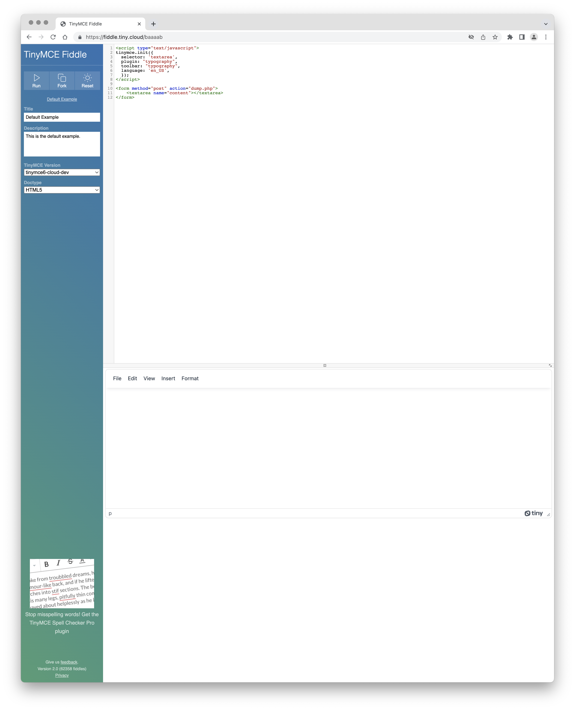
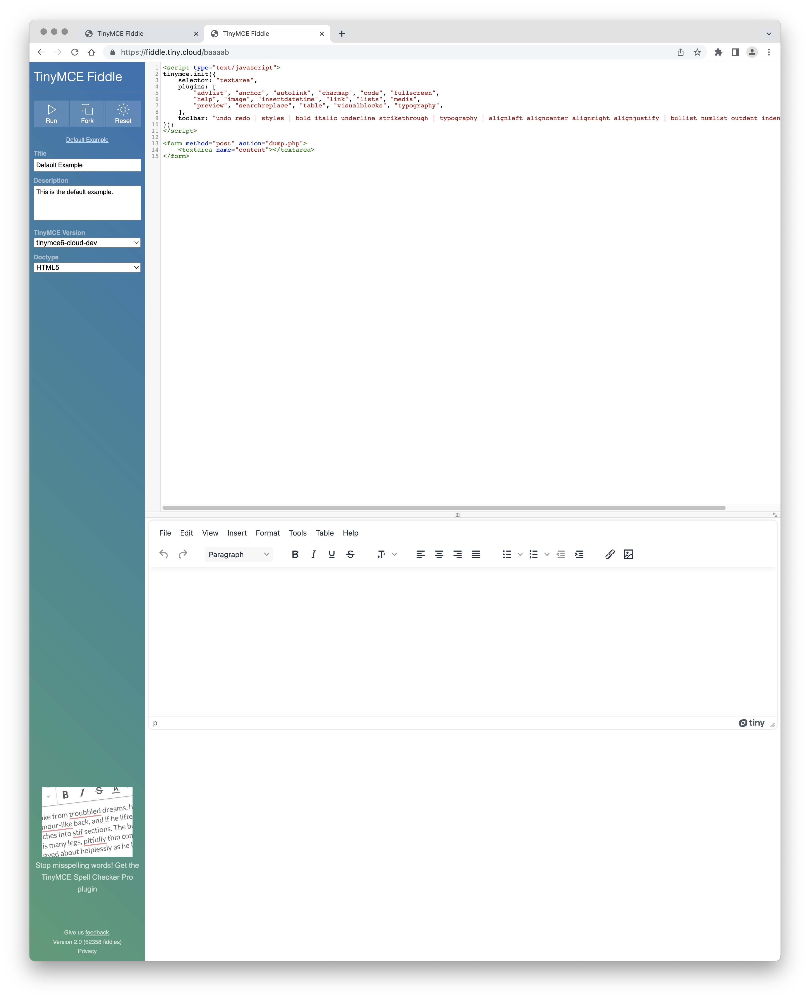

# Extant text

```asciidoc
// What this option does, precisely.

*Type:* `+Object+`

=== Example: Using `content_langs`

[source,js]
----
tinymce.init({
  selector: 'textarea',  // change this value according to your html
  plugin: typography
  toolbar: typography
  language: 'en_US' // This is required to configure the default language used by typography.
  content_langs: [
    { title: 'English', code: 'en' }
    { title: 'Spanish', code: 'es' }
    { title: 'German', code: 'de' }
    ]
});
----
```

# Task

Turn the commented-out string into a _not_ commented-out string.

## Doing the task

1. load <https://fiddle.tiny.cloud/>

2. replace default example

   ```js
   tinymce.init({
    selector: "textarea",
    plugins: [
        "advlist", "anchor", "autolink", "charmap", "code", "fullscreen", 
        "help", "image", "insertdatetime", "link", "lists", "media", 
        "preview", "searchreplace", "table", "visualblocks", 
    ],
    toolbar: "undo redo | styles | bold italic underline strikethrough | alignleft aligncenter alignright alignjustify | bullist numlist outdent indent | link image"
    });
    ```


  with example in extant text

## First Oops

The example in the extant text doesn’t work:


### First (almost) fix

Edit the example as follows:

```js
tinymce.init({
  selector: 'textarea',
  plugin: "typography",
  toolbar: "typography",
  language: 'en_US',
});
```

This mostly works, except the toolbar doesn’t present:



### Second (almost) fix

Edit the almost working example on a hunch and it comes a step closer to working as expected, but not the whole way.

Further edits to the example:

```js
tinymce.init({
  selector: 'textarea',
  plugin: "typography",
  toolbar: "typography | bold",
  language: 'en_US',
});
```
The toolbar now shows up, but only the **Bold** toolbar button displays.


### Third (actual but not) fix

Ignore the extant example and tweak the default fiddle.

```js
tinymce.init({
 selector: "textarea",
 plugins: [
     "advlist", "anchor", "autolink", "charmap", "code", "fullscreen", 
     "help", "image", "insertdatetime", "link", "lists", "media", 
     "preview", "searchreplace", "table", "visualblocks", "typography", 
 ],
 toolbar: "undo redo | styles | bold italic underline strikethrough | typography | alignleft aligncenter alignright alignjustify | bullist numlist outdent indent | link image"
});
 ```
And everything shows as expected, plus a whole lot more than is wanted for an example in the documentation:



### Getting back on track?

Still this is closer to being able to try things out and document. So, let’s add an edit to the tweaked default fiddle:

```js
tinymce.init({
 selector: "textarea",
 plugins: [
     "advlist", "anchor", "autolink", "charmap", "code", "fullscreen", 
     "help", "image", "insertdatetime", "link", "lists", "media", 
     "preview", "searchreplace", "table", "visualblocks", "typography", 
 ],
 toolbar: "undo redo | styles | bold italic underline strikethrough | typography | alignleft aligncenter alignright alignjustify | bullist numlist outdent indent | link image"
  language: 'en_US'
  content_langs: [
    { title: 'English', code: 'en' }
    { title: 'Spanish', code: 'es' }
    { title: 'German', code: 'de' }
    ]
});
```

Well, that’s frustrating:


### the state of things

The following loads a working editor but I don’t see a _Typography_ toolbar button:

```js
tinymce.init({
  selector: 'textarea',
  plugin: "typography",
  toolbar: "| bold | italic | underline | typography",
  language: 'en_US',
  });
```

And the following loads a working editor with a _Typography_ toolbar button but doesn’t have all the apparently necessary parameters loaded:

```js
tinymce.init({
    selector: "textarea",
    plugins: [
        "advlist", "anchor", "autolink", "charmap", "code", "fullscreen", 
        "help", "image", "insertdatetime", "link", "lists", "media", 
        "preview", "searchreplace", "table", "visualblocks", "typography", 
    ],
    toolbar: "undo redo | styles | bold italic underline strikethrough | typography | alignleft aligncenter alignright alignjustify | bullist numlist outdent indent | link image"
});
```

This tweaked default fiddle is also… _overloaded_ as examples go: it’s too busy to be used in an example.

Finally, including these (apparently necessary) parameters breaks the editor completely:

```js
language: 'en_US'
content_langs: [
  { title: 'English', code: 'en' }
  { title: 'Spanish', code: 'es' }
  { title: 'German', code: 'de' }
  ]
```

All of which is just a touch frustrating.

I’m missing something, clearly. But I’ve no clues as to what.